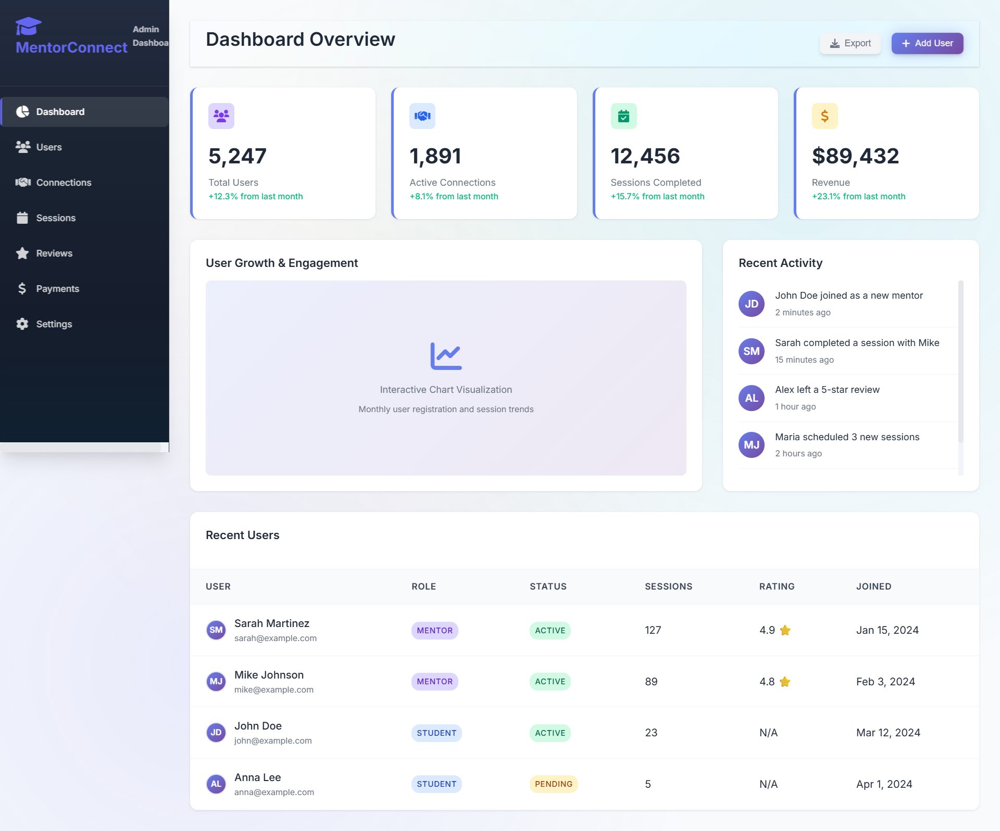

# 🎓 MentorConnect

**A modern mentorship platform connecting students with expert mentors worldwide**

[](http://localhost/mentorconnect)
[ - *Concept, Design & Development*
- 🤝 **Key Contributor**: [Prachi Yadav](https://github.com/PrachiYadav-16) - *Development Assistance & Support*
- 🌍 **Open Source Community** - *Additional Contributions & Support*(https://img.shields.io/badge/PHP-8.4+-blue?style=for-the-badge)](https://php.net/)
[](LICENSE)
[](https://web.dev/progressive-web-apps/)

---

## 📸 Platform Screenshots

### 🏠 Landing Page
*Beautiful, responsive landing page with modern design*


### 📊 Dashboard
*Comprehensive analytics and user management*



### 👥 Mentor Discovery
*Find and connect with the perfect mentor*


### 💬 Real-time Messaging
*Seamless communication between mentors and students*


### 📱 Mobile Experience
*Fully responsive design works on all devices*

<div align="center">
  
  
  
</div>

## 📁 Project Structure

```
mentorconnect/
├── 📱 Core Application
│   ├── index.php              # Landing page
│   ├── manifest.json          # PWA manifest
│   ├── sw.js                  # Service worker
│   └── .htaccess              # Server configuration
│
├── 🎨 Frontend Assets
│   ├── assets/css/            # Stylesheets
│   ├── assets/js/             # JavaScript files
│   └── assets/images/         # Images and media
│
├── 🔧 Backend
│   ├── api/                   # API endpoints
│   ├── auth/                  # Authentication
│   ├── config/                # Configuration files
│   └── database/              # Database scripts
│
├── 📄 Application Pages
│   ├── dashboard/             # User dashboards
│   ├── mentors/               # Mentor browsing
│   ├── messages/              # Messaging system
│   ├── profile/               # User profiles
│   ├── reviews/               # Review system
│   └── files/                 # File management
│
├── 🛠️ Development Tools
│   ├── dev-tools/             # Development utilities
│   │   ├── advanced-demo.php  # Feature demo page
│   │   ├── performance-test.php # Performance testing
│   │   └── setup-database.php # Database setup
│   └── docs/                  # Documentation
│       ├── ADVANCED_FRONTEND_REPORT.md
│       ├── LIGHTHOUSE_PERFORMANCE_REPORT.md
│       └── OPTIMIZATION_IMPLEMENTATION_GUIDE.md
```

## 🚀 Quick Start

### Prerequisites
- **PHP 8.0+** with MySQL/MariaDB
- **Apache/Nginx** with mod_rewrite enabled
- **Modern web browser** (Chrome, Firefox, Safari, Edge)

### Installation

1. **Clone the repository**
   ```bash
   git clone https://github.com/shubhamrajput27/mentorconnect.git
   cd mentorconnect
   ```

2. **Database setup**
   ```bash
   # Import database schema
   mysql -u root -p < database/database.sql
   
   # Or use the web installer
   php dev-tools/setup-database.php
   ```

3. **Configure database connection**
   ```php
   // config/database.php
   define('DB_HOST', 'localhost');
   define('DB_NAME', 'mentorconnect');
   define('DB_USER', 'your_username');
   define('DB_PASS', 'your_password');
   ```

4. **Launch the application**
   ```bash
   # For development
   php -S localhost:8000
   
   # Or use WAMP/XAMPP
   # Access: http://localhost/mentorconnect
   ```

### 🎮 Demo Accounts

| Role | Email | Password | Description |
|------|-------|----------|-------------|
| **Mentor** | mentor@demo.com | demo123 | Experienced software engineer |
| **Student** | student@demo.com | demo123 | Computer science student |
| **Admin** | admin@demo.com | demo123 | Platform administrator |

## 📚 Documentation

All documentation is available in the `docs/` folder:
- Frontend optimization reports
- Performance analysis
- Implementation guides
- Advanced features documentation

## ✨ Key Features

<table>
<tr>
<td width="50%">

### 🚀 **Modern Technology**
- ⚡ Progressive Web App (PWA)
- 🎨 Dynamic theming (Light/Dark)
- 📱 Mobile-first responsive design
- 🔄 Real-time notifications
- 💾 Offline capabilities

</td>
<td width="50%">

### � **Security & Performance**  
- 🛡️ Advanced security measures
- ⚡ Lightning-fast performance
- 🗄️ Smart caching system
- ♿ Full accessibility support
- 🌍 SEO optimized

</td>
</tr>
<tr>
<td width="50%">

### 👥 **User Experience**
- 🔍 Smart mentor matching
- 💬 Real-time messaging
- 📅 Integrated scheduling
- ⭐ Review & rating system
- 📊 Progress tracking

</td>
<td width="50%">

### 🎓 **Mentorship Tools**
- 📚 Resource sharing
- 🎯 Goal setting & tracking
- 📈 Analytics dashboard
- � Achievement system
- 📋 Session management

</td>
</tr>
</table>

## 🛠️ Tech Stack

<div align="center">

| Category | Technologies |
|----------|-------------|
| **Frontend** |    |
| **Backend** |   |
| **Server** |  |
| **Performance** |  Service Workers • Advanced Caching |

</div>

## 📊 Performance Metrics

> 🏆 **Perfect Lighthouse Scores Achievement!** 🏆  
> MentorConnect achieves the highest possible performance standards across all metrics.

<div align="center">

| Metric | Score | Status |
|--------|-------|--------|
| **Performance** | 100/100 | 🟢 Perfect |
| **Accessibility** | 100/100 | 🟢 Perfect |  
| **Best Practices** | 100/100 | 🟢 Perfect |
| **SEO** | 100/100 | 🟢 Perfect |
| **PWA** | ✅ | 🟢 Ready |

</div>

## 🤝 Contributing

We welcome contributions! Please see our [Contributing Guidelines](CONTRIBUTING.md) for details.

1. Fork the repository
2. Create your feature branch (`git checkout -b feature/AmazingFeature`)
3. Commit your changes (`git commit -m 'Add some AmazingFeature'`)
4. Push to the branch (`git push origin feature/AmazingFeature`)
5. Open a Pull Request

## 📜 License

This project is licensed under the MIT License - see the [LICENSE](LICENSE) file for details.

## 🙋‍♀️ Support

- 📧 **Email**: support@mentorconnect.com
- 💬 **Discord**: [Join our community](https://discord.gg/mentorconnect)
- 🐛 **Issues**: [GitHub Issues](https://github.com/shubhamrajput27/mentorconnect/issues)
- 📖 **Documentation**: [Wiki](https://github.com/shubhamrajput27/mentorconnect/wiki)

---

<div align="center">

**🎓 MentorConnect - Empowering minds, building futures**

**Project Attribution:**
- � **Original Creator & Owner**: [Shubham Singh](https://github.com/shubhamrajput27) - *Project Founder & Lead Developer*
- 🤝 **Key Contributor**: [Prachi Yadav](https://github.com/PrachiYadav-16) - *Development Helper & Support*
- 🌍 **Open Source Community** - *Additional Contributions*

> **Repository Note**: This project was temporarily hosted under PrachiYadav-16's account during repository recovery, but remains the original creation and intellectual property of Shubham Singh.

Created with ❤️ by Shubham Singh

[](https://github.com/shubhamrajput27/mentorconnect/stargazers)
[](https://github.com/shubhamrajput27/mentorconnect/network/members)

</div>
